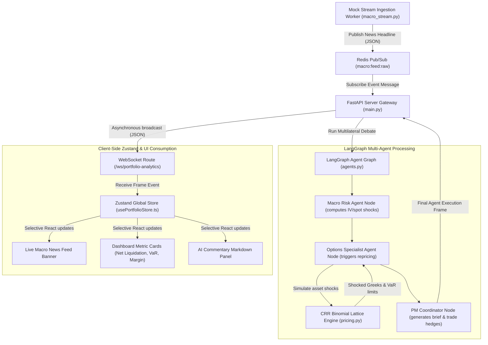

# Architectural Map - AlphaAegis Event Pipeline Topology

This document maps out the end-to-end data flow and event-driven network pipeline of the AlphaAegis options suite, detailing how real-time news feeds, multi-agent evaluation nodes, and async socket gateways interact.

---

## 🗺️ Architectural Flow Diagram

---

## 🚀 Event Pipeline Execution Phases

### 1. Ingestion Engine
- **Worker Service:** A dedicated async service in [macro_stream.py](file:///Users/moemahmood/builder_code/myoption/backend/app/services/macro_stream.py) processes macro financial events.
- **Redis Channel:** Encodes events as JSON payloads and publishes them to the Redis Pub/Sub memory channel `macro:feed:raw`.

### 2. Multi-Agent LangGraph Node Processing
- **AgentState:** Holds the macro event variables alongside the loaded portfolio positions state.
- **Agent Nodes:**
  - **Macro Risk Agent:** Ingests raw headline data, scores text sentiment, and defines localized IV/Spot shocks.
  - **Options Specialist Agent:** Calls the Cox-Ross-Rubin Binomial Lattice engine ([pricing.py](file:///Users/moemahmood/builder_code/myoption/backend/app/services/pricing.py)) to shock and re-price all positions, adjusting portfolio Value-at-Risk (VaR).
  - **PM Coordinator:** Integrates Greek analytics, debate logs, and generates staged action recommendations.

### 3. Asynchronous Broadcasting Gateway
- **FastAPI Listener:** In [main.py](file:///Users/moemahmood/builder_code/myoption/backend/app/main.py), a background listener monitors the Redis channels.
- **Broadcast:** Pushes the finalized calculations downstream over the persistent `/ws/portfolio-analytics` WebSocket channel to all connected client applications.

### 4. Client State Consumption (Zustand)
- **Centralized Store:** The store at [usePortfolioStore.ts](file:///Users/moemahmood/builder_code/myoption/frontend/src/store/usePortfolioStore.ts) catches the event and caches the new calculations.
- **UI Reactivity Boundary:** Key components like the Live News marquee banner, Greek dashboard metrics, and Markdown narrative blocks read from selective slices of the store, allowing sub-components to update at 60 FPS without triggering parent component redraws.
